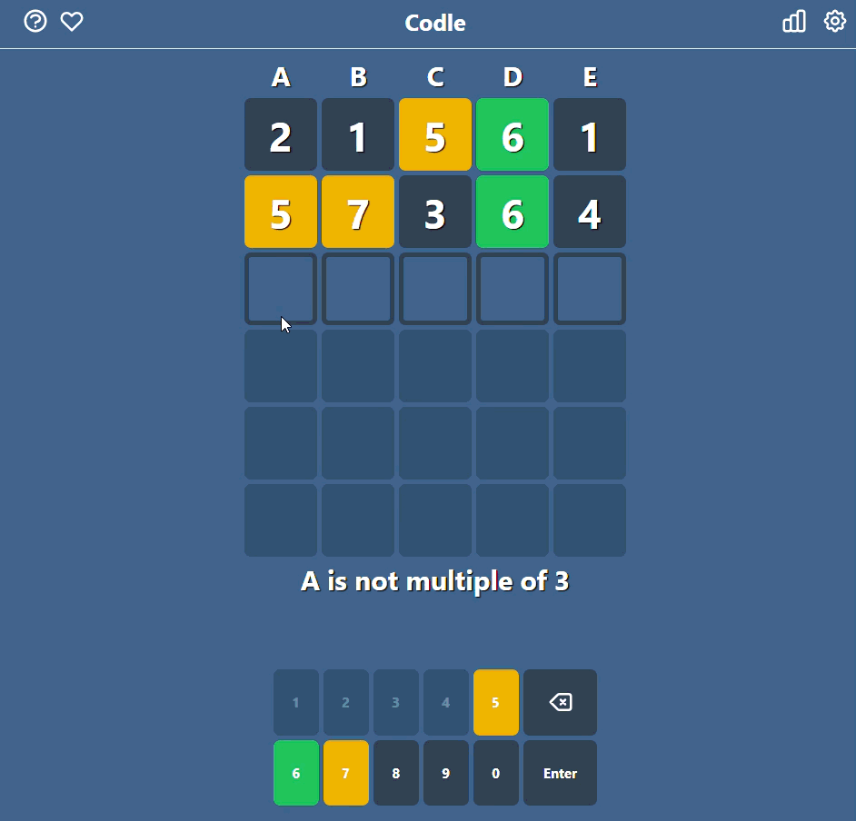

# Codle React - [Forked from react-wordle](https://github.com/cwackerfuss/react-wordle)

[](https://github.com/FehTeh/codle-react/actions/workflows/lint.yml)
[](https://github.com/FehTeh/codle-react/actions/workflows/test.yml)


This is based on the famous Wordle game but the objective is to find a daily code with one hint per column.
Made using React, Typescript, and Tailwind.

<p align="center">
  
</p>

[**Try it!**](https://codle-react.pages.dev/)

## Build and run

### To Run Locally:

Clone the repository and perform the following command line actions:

```bash
$> cd codle-react
$> npm install
$> npm run start
```